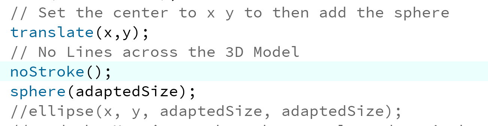

# Sun System with Processing

### General information

Goal of the project is to write a program that shows part of the sun system with textures. So that it would look something like this:

At first I came across Three.js which is a cross browser JavaScript library. It seemed to fit the use case but I  don't really like JavaScript so I looked for an alternative.

I per coincidence came across the Programming library Processing. It is open source and comes  with a **very**  simple IDE.

Proccesing uses the Java language with additional classes and simplifications. 

Every program you write is called a sketch in Processing that actually is a subclass of the Java class PApplet.  All classes that then are wrote in the sketches are treated as inner classes when the code is translated to pure Java before compiling. 

I should also mention that there is also Processing.js that uses the Canvas element for rendering so that Processing can be used on the web and doesn't need any Java plugin any more.

When installing a library I noticed that there are many more modes to use in Proccesing

After installing the mode you can easily switch mode in the ide (right upper corner).

Since I documented the code in the classes I will not go further into the code I wrote itself.

### Problems 

I had problems adding the buttons to my program.  The FAQ of the github repo from proccessing  showed this annoying information:

"The main rule when using Java code: You cannot use most of the AWT or Swing (which is built on the AWT), because it will interfere with the graphics model. If you want to add scroll bars and buttons to your projects, you should make them using Processing code, or embed your Processing applet inside another Swing or AWT application (see below)."

My simple solution was to don't use any on screen buttons and just use keyboard input.

### Solar System 2d

I soon had my Solarsystem in 2D but I wanted to make it 3D.

To do that I had to add the parameter size(900,900,**P3D**); to the size of the sciene. Then I had to change all ellipses to spheres. But before that I had to call the method translate since the sphere functions doesn't allow us the give the x and y cordinates. (It sets the sphere to 0,0 so I used the translate method to set x,y position to 0,0)

### Adding Light for a better 3D effect

### Adding Library PeasyCam

I then installed and added PeasyCam.

I created a PeasyCam object and add set it to this scene. The 500 are the amount of pixels I am away from looking at the objects.

Then I removed the translate (width/2, height/2); I previously had added so that I could look at the sunsystem from the center.

Result:

I was able to load the the textures but the program got really slow and you had and you have to wait to see the effect.

### Sources

http://planetpixelemporium.com/

https://www.geo.de/geolino/forschung-und-technik/4917-rtkl-weltraum-unser-sonnensystem

https://en.wikipedia.org/wiki/Processing_(programming_language)

https://de.wikipedia.org/wiki/Mars_(Planet)

https://michaelkipp.de/processing/index.html#toc-prog1

https://www.youtube.com/channel/UCvjgXvBlbQiydffZU7m1_aw

https://thecodingtrain.com/CodingChallenges/007-solarsystemgenerator